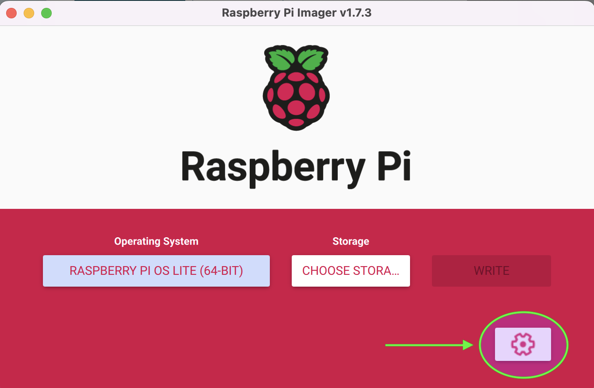
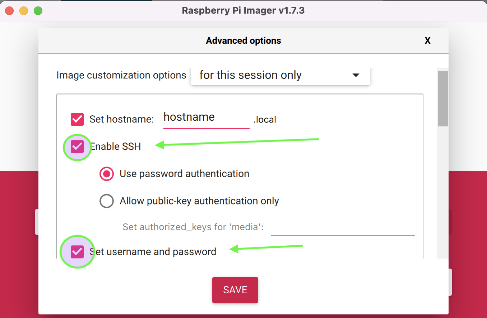

# Plex Raspberry Pi

Using Ansible to get a Raspberry Pi 4 running Raspbian OS

https://www.raspberrypi.org/downloads/raspberry-pi-os/

Raspberry Pi OS (64-bit) Lite

## Pre-req

Advanced OS settings menu



Set SSH to Enabled and set user and password



Add ssh environment vars

```bash
export MEDIAUSER=youruser
export MEDIAPASS=yourpassword
```

## Run

*Don't forget to add your server to the inventory file*

### Install

`ansible-navigator run plex_rpi4.yml -i hosts --penv MEDIAUSER MEDIAPASS`

### Using community ee

`ansible-navigator run plex_rpi4.yml -i hosts --execution-environment-image ghcr.io/ansible-community/community-ee-base:latest --pull-policy missing -m stdout --penv MEDIAUSER MEDIAPASS`

### Update

`ansible-navigator run plex_update.yml -i hosts --penv MEDIAUSER MEDIAPASS`

### Update with custom ee

`ansible-navigator run plex_update.yml -i hosts --penv MEDIAUSER MEDIAPASS --execution-environment-image ansible-execution-env`


## Sources of help

https://pimylifeup.com/raspberry-pi-plex-server/

## Drive help

NOTE: this is in the ansible playbook. However keeping here for reference if needed later.

Use lsusb and lsblk to find out where the drive is being seen
  
### Mount drive

`sudo mount -t exfat /dev/sda2 /media/mediaplus`

### Verify the mount

`df -h`

### Unmount drive

assuming drive is located in /dev/sda2

`sudo umount /dev/sda2`
